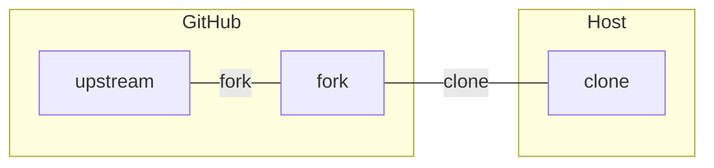

# Microcontroller Training
Objective of this training is to exercise the commonly used interfaces on a standard microcontroller such as STM32F Family.

# Reference Material
[ARM M4 Reference Manual: Main Page](https://developer.arm.com/documentation/100166/0001/)

# Programs and Utilities
[STMCubeIDE](https://www.st.com/en/development-tools/stm32cubeide.html)
[STMStudio](https://www.st.com/en/development-tools/stm-studio-stm32.html) 

# Parts
[NUCLEO-F446ZE](https://estore.st.com/en/nucleo-f446ze-cpn.html)  Currently Out Of Stock

# Setup Development Environment
This section will cover the following topics:
- Software Development Flow
- Download the IDE tool, build simple Hello Application
- Get familiar with the project environment, settings
- Explain the file and directory structure and the reason why its setup that way
- Give example of file code setup, recommended etc.
- Know how to use JTAG debugger, set/clear breakpoints, view memory, attach to a running system for the simple hello application
- Experiment with other STMicro tools

## Software Development Workflow

Before diving into coding, we will cover the following:
- Source Code Management Structure for collaborative work
- Folder structure to track all your projects for this training 
- Source Code Management Structure

Though the main focus of this tutorial is on microcontroller 
development, we will spend time learning `git` and other support tools
for general software development.

### Source Code Management & Collaborative Work
`git` is the tool that will be used to support tracking changes in your work as well as allow you to share and sync work
from other people.  `git` by itself is a utility that runs on your local *host* environment.  

`GitHub` is a service that allows you to host (store) your repositories on the internet so that it can be shared among other remote developers. In order to access Github, you will need to set up "keys" so that your `git` utility running on the *host* ie your workstation, will access repositories that are *hosted* on Github.

> **Terminology**  
> *host* used as a noun is the workstation or laptop or whatever you use for developing your code  
> *target* is the device environment where your code executes on  
> *host* used as a verb is the action of containing and running some application.  

#### Creating a Fork
All projects in this tutorial will be created and stored in your respective *forks* of this repo.  
A *fork* is like a fork in the road where the new road continues on independent of the original road.  

Create a fork off this repo.  Navigate to https://github.com/ahonkan/microcontroller_training and click on
.  In software development terminology the `ahonkan/microcontroller_training`
repository is the *upstream* repository and your specific repository is now the *downstream* repository or 
*local fork.  

Later on as there is more content or changing content in this upstream repository, you will want to *sync your fork*
with the upstream to keep your repo updated with all the changes at upstream.  This is relevant when multiple
contributors add content to the upstream and you want to make sure you have all the latest changes.  
The specifics of collaborative work will be covered later when it becomes relevant.  For now, you can sync your fork
by following instructions here: https://docs.github.com/en/pull-requests/collaborating-with-pull-requests/working-with-forks/syncing-a-fork

> **Terminology**  
> *fork* A copy of a repository whose structure & layout can be modified without affecting the original repository  
> *upstream* The original repository from which the *fork* took place  
> *downstream* Yours and other repositories that were forked from the main *upstream* repository.  
> *sync your fork* You update/sync your *downstream* fork with all the changes that have happened on the *upstream* fork.  *upstream* fork will contain all the latest changes that you want

### Workspace Setup for Lessions

Folder organization is very important when developing code.  
For the lessions, the following structure will be set up:
```
~/swdev/
~/swdev/microcontroller_training/
~/swdev/microcontroller_training/ide_introduction
~/swdev/microcontroller_training/<other projects>
```
The `swdev` will be the root folder where all the instructions, test projects
git repositories etc will reside that are relevant for software development.

> **NOTE** The folders under `microcontroller_training` could come from syncing to upstream or from local development etc.

#### Create A Main Folder For Software Development
In your linux terminal, type in following commands:
```
cd ~
mkdir swdev
```
`cd ~` changes the directory to your home directory
`mkdir swdev` creates the `swdev` diretory which will contain all your
software development projects, tests etc.

#### Creating Github Access Keys
Before you can access code on Github, you will need to set up your host machine with access keys so that you can perform `git` operations that access your Github account.  
The link below will walk you through this setup process:
https://docs.github.com/en/authentication/connecting-to-github-with-ssh/adding-a-new-ssh-key-to-your-github-account

#### Clone this training repository
```
cd ~/swdev/
git clone git@github.com:<your_git_id>/microcontroller_training.git
```
If your keys were set up correctly, you should see something similar to the following displayed on your screen:
```
Cloning into 'microcontroller_training'...
remote: Enumerating objects: 76, done.
remote: Counting objects: 100% (76/76), done.
remote: Compressing objects: 100% (71/71), done.
remote: Total 76 (delta 44), reused 9 (delta 3), pack-reused 0
Receiving objects: 100% (76/76), 26.99 KiB | 708.00 KiB/s, done.
Resolving deltas: 100% (44/44), done.
```

# Project 1: git workflow
This project will walk through a basic `git` workflow that you will use on a regular basis.  The objective of this exercise is to learn how to modify code on your host machine and then store the changes back on Github for future reference.  




----


  

## Configure Pin Mux Settings
Use configuration tool to configure GPIO pins to access LED & Buttons, then other facilities.

## Execution Context
The microcontroller has two types of execution context:
- Main Execution 
- Interrupt Execution

### Main Execution: LED Push Button
We are going to write a main loop program that lights the LED when the push-button is pressed.
This code loops forever waiting on user action.

### Interrupt Execution: LED Push Button
We are going to review the ARM Core interrupts and then configure the ARM Core timer to run periodically and toggle the LED.  
Use push button to gate the toggle operation.  
Discuss difference between ARM core timer vs SOC timer.  

## LED Push Button- GPIO Interrupt
Use push button to control LED via interrupt.
Specific SOC interrupt (STMicro) configuration.  Configure push button to toggle LED.
ARM extended interrupt table.
Play with WAI and low power operation

## UART Operation- Character Echo
- main loop
- interrupt
- DMA
Set up UART and echo character.

## UART Operation- Line Echo
Echo character and when the enter key is pressed, it prints out the full line, and starts over.

## UART Operation- Command Line processing
Echo characters, and when enter key is pressed, the string entered will be broken into words separated by spaces.
The first word is the command and the remaining are arguments.
Implement command:  "led on" and "led off"

## DAC DMA & Timer
https://www.adafruit.com/product/2130  

Configure DAC with DMA to convert data out at a fixed rate.  
Create a DTMF Tone Generator.

## ADC & DMA
https://www.adafruit.com/product/1063  

Configure ADC to capture analog signals, link with DMA to capture and store data.  
Capture from external signal generator if available.
Create a DTMF Tone Detector

## ADC & DAC- Audio Delay, Audio Speed up 
Connect ADC, DAC and record & play back sound at normal or at another rate based on push button 
Use DMA transfers to make this not take up cpu cycles and use timer to pace the DAC

## Timer - STM32F Timer Block
Use STM Timer interrupt to toggle LED 
Configure PWM to fixed duty cycle
Connect DMA to PWM reload and generate a ramp pwm signal

## I2C
I2C Temp: https://www.adafruit.com/product/1782  
Set up I2C temperature sensor.  Capture data based on periodic interrupt.

## SPI
Set up two SPI interfaces on board, one master one slave, and perform transactions.


Hardware faults
Memory page segmentation
Profiling
FreeRTOS

## USB (optional)

## Capstone Project: Temperature Controller
Physically attach temperature sensor to a power resistor.   
Use the temperature reading to control PWM on a FET driver that drives current through the power resistor.  Maintain fixed temperature on resistor.

## Capstone Project: N-Phase Switching Power Supply
PWM& ADC voltage feedback

## Capstone Project: N Baud Modem
Timers, ADC, DAC

## Capstone Project: Self Leveler
Accelerometer & Servo motor to keep a platform Level
I2C/SPI, PWM

## Capstone Project (Advance): USB Gadget Device
Configure USB as Audio input/output device- ADC/DAC
USB Annoy-a-tron:  USB configured as mouse (HID)  device and using screen feedback, make mouse move in patterns on the screen.
https://sourceforge.net/projects/mpos/


